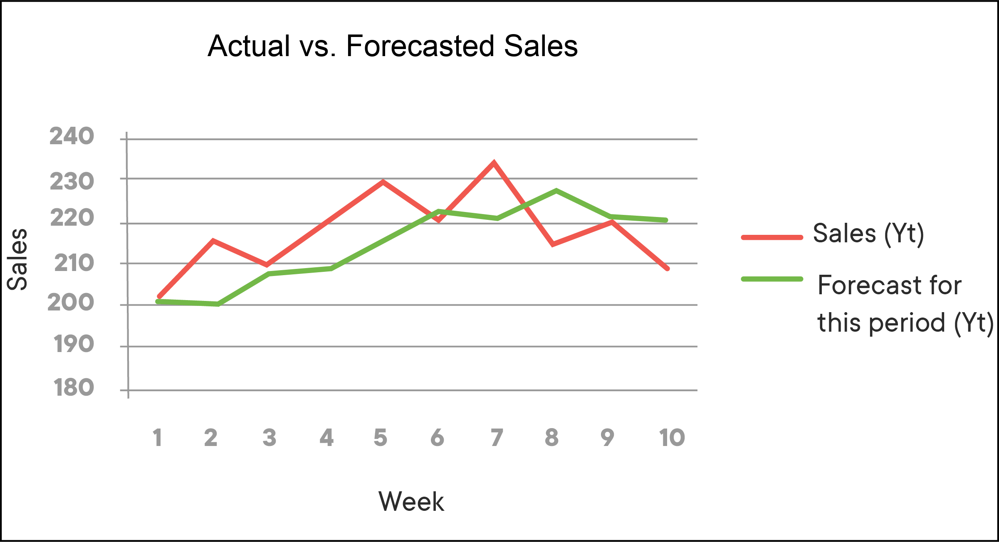

# Problems Data Science Can Solve

## Introduction 

In this lesson we will look at what data science is and the different kinds of problems that it can be used to solve. By the end of the lesson you should be able to answer which technique you would use as a professional data scientist for a particular business problem. 

## Objectives
You will be able to:
* Describe the problems data science can solve

## What Problems Can Data Science Solve?

Congratulations on deciding to become a data scientist! Before we dig into the details of the tools and techniques that you'll need to learn, it's important to take a little time to understand what you'll be able to do once you graduate. Here is a list of some of the common types of business problems data scientists are expected to solve. 

## 1. Regression: How much or how many? 

Regression analysis is used to predict a continuous value - such as the number of staff you'll need for a busy shift or the likely sale price of a house. 

### Example:  Sales or Market Forecasts

Traditional trend analysis only looks at how one business entity changes with respect to another. Regression analyses can provide insight into how an outcome will change when several other variables are modified.

## 2. Classification: Which category?

Classification is used to predict which category something will fall into. If you're trying to figure out whether a client is likely to default on a loan (i.e., default or no default) or which of your products a customer is likely to prefer, you're dealing with a classification problem.

### Example: Credit Rating

Credit card companies receive hundreds of thousands of applications for new credit cards every week. These applications contain detailed information on social, economic, and personal attributes of applicants. Classification analysis can allow companies to categorize these applications based on the quality of their credit.

## 3. Anomaly detection: Is this weird?

Anomaly detection is a common data science technique used to find unusual patterns that do not conform to expected behavior. It has applications across various industries from intrusion detection (identifying strange patterns in network traffic that could signal a hack) to fraud detection in credit card transactions to fault detection in operating environments.

### Example: Identifying Fraud

This approach focuses on finding **outliers** in the data that appear to have unusual patterns. This serves as a first indication of the presence of fraudulent activity. Such approaches are also frequently applied by large social networks like Facebook, Twitter, etc.

## 4. Recommender systems: Which item would a user prefer?

Recommender systems are one of the most popular applications of data science today. They are used to predict user preferences towards a product/service. Almost every major tech company (Amazon, Netflix, Google, Facebook) has applied them in some form or the other. You might have noticed phrases like "If you like this product, you may also like ...", "Users who bought this item also bought ...", and "Based on your preferences, we recommend following products to you ...". You got it, these are all recommender systems in action. 

Recommender systems can help a business retain customers by providing them with tailored suggestions specific to their needs. They can help increase sales and create brand loyalty through relevant personalization. When a customer feels as though they are understood by your brand, they are more likely to stay loyal and continue purchasing through your site.
According to a recent study by McKinsey, up to 75% of what consumers watch on Netflix comes from the company’s recommender system. Retail giant Amazon credits recommender systems with 35% of their revenue. Best Buy decided to focus on their online sales, and in 2016’s second quarter they reported a 23.7% increase, thanks in part to their recommender system. 

## Summary

While you're going to learn to use a wide range of tools and techniques throughout this course, most of them will be used to predict a continuous value, to decide the most likely category for a value, to identify anomalies or to provide recommendations.

